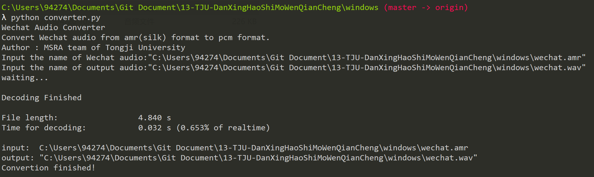

# AMR2PCM
微软学生项目-微信语音转码为WAV格式

## 项目介绍

本项目的宗旨在于将微信语音转换为通用的wav格式。微信语音的格式为SILK，是Skype开发的一种专为网络语音传输使用的格式，具有体积小但保真度高的特点。SILK格式首先需要转换为PCM格式，再将PCM格式转换为WAV格式。目前，在Windows平台上已经实现了SILK->PCM->WAV的转换，Mac和Linux平台上只实现了SILK->PCM的转换。

下面以Windows平台为例说明我们项目的工作流程。

## SILK->PCM

使用Skype官方提供的解码器完成工作。转换器为`silk2pcm.exe`。

## PCM->WAV

PCM格式与WAV格式基本一致，区别只在于它们的文件头部，WAV比PCM多一些音频文件的说明信息，这些信息可以通过文件本身计算出来，写入文件头部即可。我们的转换器为`silk2wav.exe`。

## 脚本

我们使用Python（3.6版本）编写了将两个转换器串联起来的脚本，使用方法如下。

## 使用方法

如图所示，运行脚本，按照提示输入要转换的文件的名称（若文件不在脚本所在的目录下还要输入地址），或直接将文件拖入命令行窗口；接下来输入转换之后的文件名称（地址问题同上）即可。双引号"不是必须的。

## 存在的问题

可能是由于编码的问题，同样的PCM->WAV转换器在Mac平台上无法正确运行，我们未能解决这个问题。

## 改进想法

PCM->WAV转换器可以直接嵌入脚本，不再使用独立的转换器。
